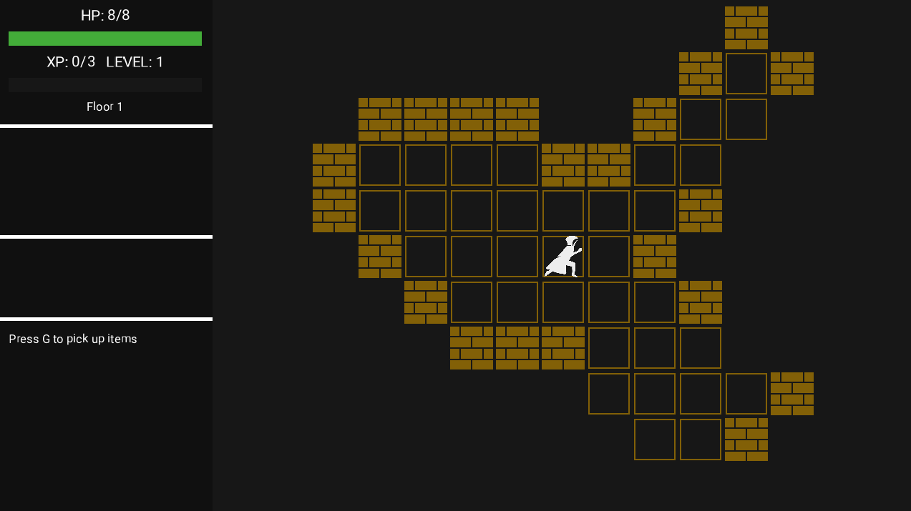
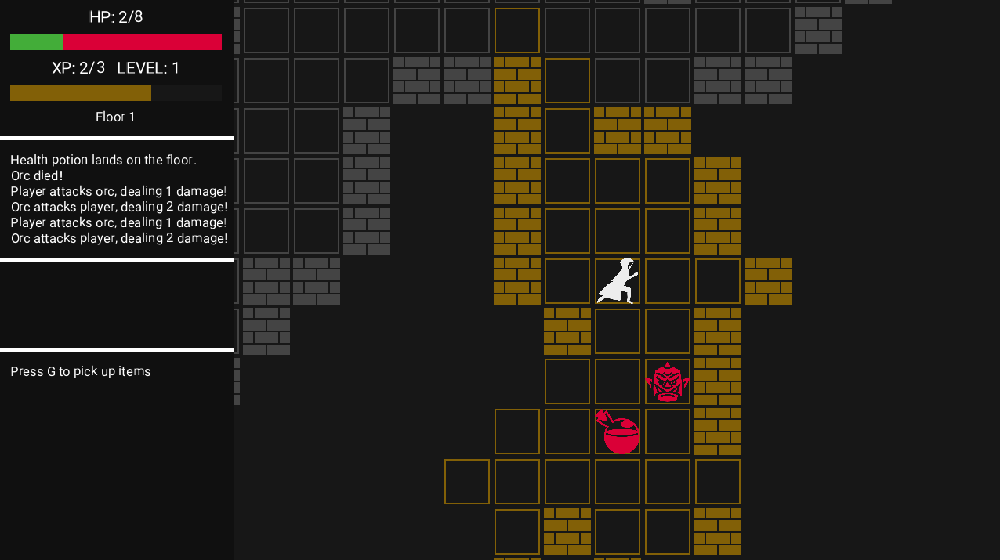

# General
This is a repository for a basic roguelike game following [/r/roguelikedev annual roguelike tutorial](https://www.reddit.com/r/roguelikedev/comments/o5x585/roguelikedev_does_the_complete_roguelike_tutorial/).
It's written in Rust with Bevy game engine and I'm using the tutorial as a rough roadmap.

## Features
- Map generation using celular automata, generation varies depending on the dungeon floor
- Spawning enemies with simple AI, fighting, gaining experience and leveling up
- Items: health potions, magic scrolls with different spells, weapons and armor

## Running
You can play it browser [here](https://michalgniadek.github.io/roguelike-tutorial-2021/)! The web version is buit automatically with github actions after every push.

## Building
Requires Rust (nightly) and cargo make (can be installed using `cargo install cargo-make`). Use `cargo make run` to run a desktop version and `cargo make serve` to build web version and start a local web server (the second command will also install a few additional dependencies).

## Screenshots
 
 